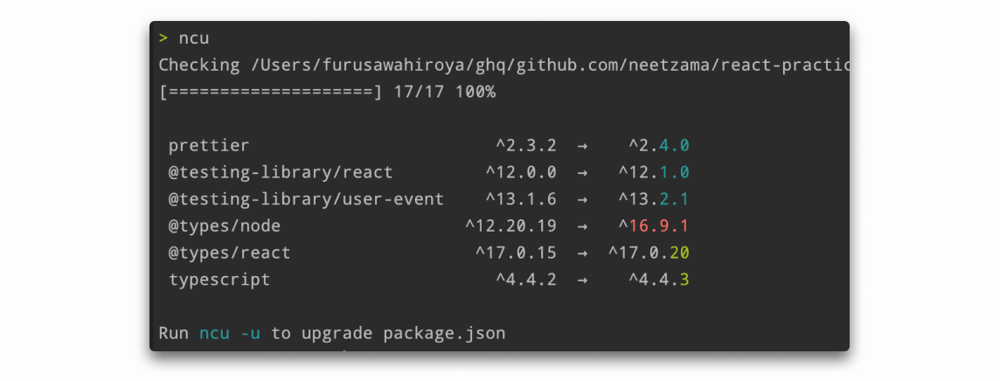
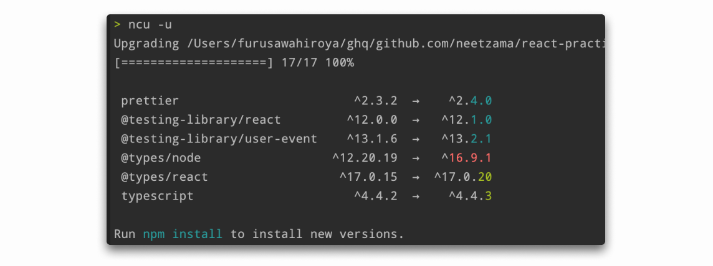
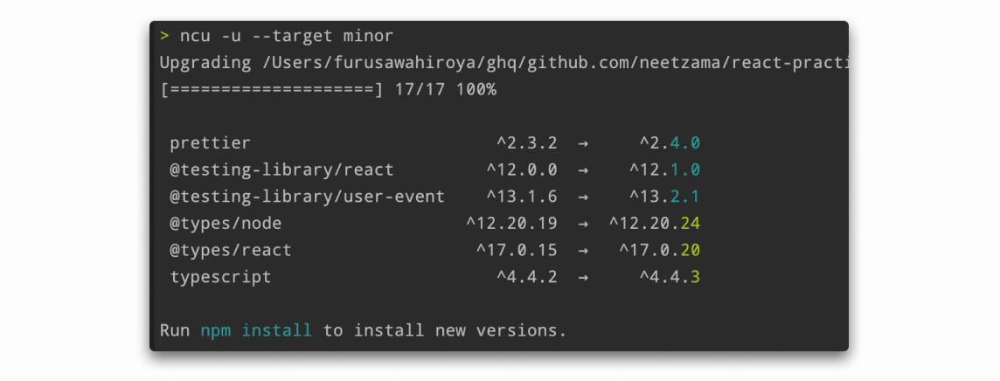
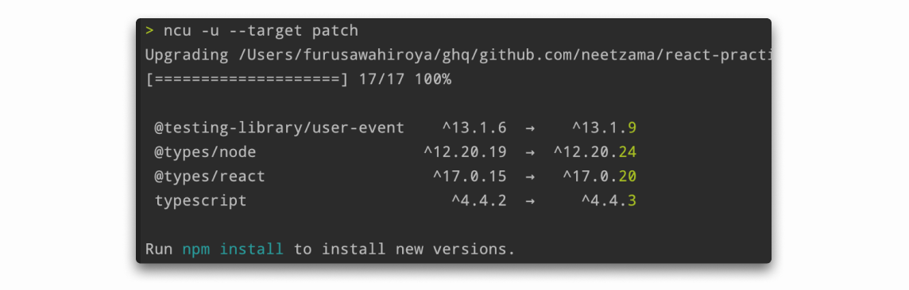

## はじめに
`npm-check-updates` を使用してプロジェクトで管理しているライブラリをアップデートしたのでまとめたいと思います。間違っている箇所などありましたら、TwitterのDMなどでご指摘いただけると幸いです。

### 環境
- Node.js v14.17.1
- npm v6.14.13
- npm-check-updates v11.8.5
- macOS Big Sur 11.2.1
Node.js のバージョン管理には`nodenv`を使用しています。

## npm-check-updates とは
[GitHubのリポジトリ](https://github.com/raineorshine/npm-check-updates) を訳しますと以下のように記述してあります。
>npm-check-updatesは、指定されたバージョンを無視して、package.jsonの依存関係を最新バージョンにアップグレードします。

## npm-check-updates をインストール
それでは以下のコマンドでインストールしていきます。
```shell script
> npm install -g npm-check-updates
```

### ncu コマンドが使えなかったら...
インストールが完了し`ncu`コマンドで確認しましたが、使えなかったのでパスを通していきたいと思います。
```shell script
> ncu
zsh: command not found: ncu
```
`~/.zshrc`に以下を記述します。
```zshrc
# ncu
export PATH=$PATH:"$HOME/.nodenv/versions/14.17.1/bin/ncu"
```
`source`コマンドも忘れずに
```shell script
> source ~/.zshrc
```

## 依存関係を表示させる
`ncu`コマンドを使用して現在のディレクトリにあるプロジェクトの新しい依存関係を色別で表示させます。



色には以下のような意味があります。
- Red 👉 メジャーバージョンのアップグレード
- Cyan 👉 マイナーアップグレード
- Green 👉 パッチアップグレード
&nbsp;  

また、`-g`オプションを付けることでグローバルのパッケージも確認することができます。
```shell script
> ncu -g
[====================] 2/2 100%

 @aws-amplify/cli    5.0.1  →   5.4.0     
```

## バージョンをアップグレード
バージョンをアップグレードさせるには以下のように`ncu -u`コマンドでアップグレードさせることができます。しかし、このコマンドは`package.json`のバージョンを書き換えているだけなので、以下のメッセージにもあるように`npm install`を実行させる必要があります。



また、アップグレードには以下のような方法も可能です。
- バージョン番号別でアップグレードさせる
- ライブラリを絞り込んでアップグレードさせる

## バージョン番号別でアップグレードさせる
`ncu -u`コマンドは全てが最新のバージョンにアップグレードされます。しかし、メジャーバージョンへのアップグレードは影響が大きいため、マイナーまたはパッチでのアップグレードをしたいときが多いと思います。その方法を見ていきたいと思います。

#### マイナーとパッチのみをアップグレード
`--target minor`を付与すると以下のようにマイナーとパッチのみをアップグレードすることができます。



#### パッチのみをアップグレード
`--target patch`を付与すると以下のようにパッチのみをアップグレードすることができます。



## ライブラリを絞り込んでアップグレードさせる
### 指定したライブラリのみ
ライブラリの名前または`--filter`、`-f`オプションを指定することによって特定のライブラリのみをアップグレードさせることができます。

```shell script
> ncu

 @testing-library/react         ^11.2.7  →   ^12.0.0     
 @testing-library/user-event    ^12.8.3  →   ^13.2.1     
 @types/jest                   ^26.0.24  →   ^27.0.1     
 @types/node                  ^12.20.24  →  ^16.7.13     

> ncu -u @types/jest

 @types/jest                   ^26.0.24  →   ^27.0.1   
```

また、ワイルドカードを用いることで以下のように、先頭に`@testing-library/`が付くライブラリの絞り込みも可能です。

```shell script
> ncu

 @testing-library/react         ^11.2.7  →   ^12.0.0     
 @testing-library/user-event    ^12.8.3  →   ^13.2.1     
 @types/jest                   ^26.0.24  →   ^27.0.1     
 @types/node                  ^12.20.24  →  ^16.7.13     

> ncu -u '/^@testing-library/.*$/'

 @testing-library/react         ^11.2.7  →  ^12.0.0     
 @testing-library/user-event    ^12.8.3  →  ^13.2.1    
```

複数指定も可能です。
```shell script
> ncu

 @testing-library/react         ^11.2.7  →   ^12.0.0     
 @testing-library/user-event    ^12.8.3  →   ^13.2.1     
 @types/jest                   ^26.0.24  →   ^27.0.1     
 @types/node                  ^12.20.24  →  ^16.7.13     

> ncu -u @testing-library/react @types/jest

 @testing-library/react         ^11.2.7  →  ^12.0.0     
 @types/jest                   ^26.0.24  →  ^27.0.1     

```


### 指定したライブラリ以外
`--reject`、`-x`オプションを使用するか、フィルターの前に`！`を付与することで、指定したライブラリ以外をアップグレードさせることができます。
```shell script
> ncu

 @types/jest   ^26.0.24  →   ^27.0.1     
 @types/node  ^12.20.24  →  ^16.7.13

> ncu -u \!@types/jest

 @types/node  ^12.20.24  →  ^16.7.13
```
こちらもワイルドカードが使用できます。
```shell script
> ncu
 
 @types/jest                   ^26.0.24  →   ^27.0.1     
 @types/node                  ^12.20.24  →  ^16.7.13     
 web-vitals                      ^1.1.2  →    ^2.1.0

> ncu -u '/^(?!@types/).*$/'

 web-vitals  ^1.1.2  →  ^2.1.0
```

## まとめ
ライブラリのバージョンアップが早いのでこまめに確認しながらアップグレードさせていきたいと思います。
